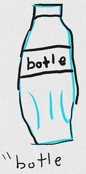

## Table of contents
* [Markdown Practice](#markdown-practice)
  * [Header 3](#header-3)
    * [Header 6](#header-6)
# Markdown Practice

### Header 3

###### Header 6
*This is italic*

_this is also italic_
**Bold**

__BOld__

_**bold** and italics_
> freidns romans countrymen
>>w.shakespeakre

* countrymen
* two
* three
- seven
- eight
- nine
1. first
2. second
3. third
6. fourth?

This is some text.

And this should go on the next line.



``` java
public static void main(String[] args){
  System.out.println("Hello World!");
}
```
end of `java` code

``` csharp
public static void Main(){
  Console.WriteLine("Hello World!");
}
```
end of `csharp` code


- [ ] Feed the beast
- [x] Water the Dog

Name  | Street  | Town
------|---------|-----
how exciting|that this works|wowzers

how do stop ok like that

:joy:
